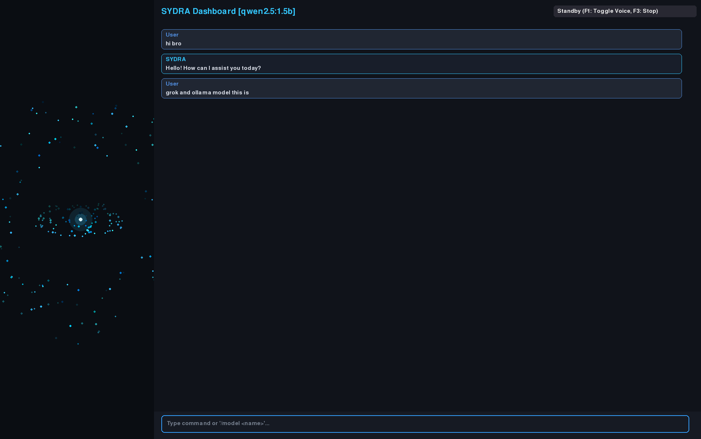

# SYDRA — System Dynamic Reasoning Assistant

SYDRA is an advanced, voice-enabled local system assistant built with Python, Pygame, and Edge-TTS. It combines hardware control (RGB lighting, screen brightness, performance profiles, thermal monitoring) with hybrid AI reasoning (Groq API & Ollama) wrapped in a retro-futuristic interactive GUI.

---

## Features

* Hybrid AI Reasoning: Seamless integration with Groq API for rapid online responses, falling back to local Ollama models (qwen2.5, llama3, etc.).
* Hardware & System Controls:
  * ASUS/OpenRGB LED lighting control with hex/color name parsing.
  * Screen brightness and system power profile switching (Performance / Power Saver).
  * Real-time CPU temperature and fan RPM monitoring.
* Interactive Saturn Interface: Custom Pygame-rendered interactive visualizer that reacts dynamically to processing states.
* Voice & Audio Pipeline: Edge-TTS speech synthesis paired with real-time speech recognition.
* Session Persistence: Saves and reloads local chat history (chat_history.json).

---

## Installation

### 1. Prerequisites (Arch / BlackArch)

Install system dependencies for audio and display:

sudo pacman -S python-pygame portaudio flac

### 2. Environment Setup

Clone the repository and set up a Python virtual environment:

git clone https://github.com/your-username/sydra.git
cd sydra

python -m venv venv
source venv/bin/activate

### 3. Install Python Dependencies

pip install requests edge-tts SpeechRecognition python-dotenv

---

## Configuration

1. Create a .env file in the root directory:

GROQ_API_KEY=your_groq_api_key_here
OLLAMA_URL=http://localhost:11434/api/chat
OLLAMA_MODEL=qwen2.5:1.5b
SYDRA_LANG=tr-TR
SYDRA_DEFAULT_CITY=Istanbul

2. Add a screenshot of your running interface to the screenshots directory as screenshots/main.png.

---

## Usage

Run the assistant within your active virtual environment:

python main.py

### Shortcuts & Commands

* F1: Toggle background voice hotword listener.
* F3: Mute active speech output and reset UI state.
* F5: Clear chat history.
* /model <model_name>: Switch the active Ollama model directly from the chat interface (e.g., /model llama3).

---

## Repository Setup & Security

Ensure sensitive files are ignored before pushing to GitHub:

git branch -M main
echo -e ".env\nvenv/\nchat_history.json\n__pycache__/\n*.mp3" > .gitignore

---

## License

Distributed under the MIT License. See LICENSE for more information.
EOF
